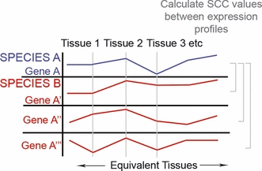
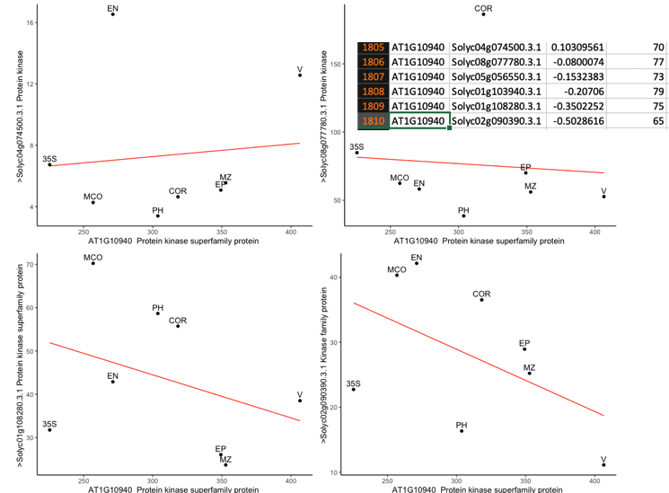

# Expressolog Guide

## Background

Expressologs are a straightforward way of resolving 1-to-N/1-to-many orthologs between pairwise species comparisons. For example, let's say we have an human gene which maps to many fly genes due to its high sequence similarity. Over evolutionary time, those fly genes may have duplicated and may have undergone neo/sub-functionalization. Expressologs allows us to resolve a more 'functional' ortholog after sequence similarity is exhausted. Namely expressologs are created comparing correlations of expression data across conditions/tissues. The ortholog will be the one with the most similar expression pattern - i.e. the best 'expressolog'. See below for a visual example:

<div>
	<p align="center">
		
	</p>
	<p align="center">
		<i>Expressolog concept visualized, excerpt from Patel et al., (2012)</i>
	</p>
</div>

This guide is based off the BAR's original 2012 expressolog [paper](https://www.ncbi.nlm.nih.gov/pubmed/22607031), however the R scripts are written by myself with confirmation of Dr. Nicholas Provart. This guide will provide a straightfoward way to create a pipeline of expressologs given only the proteome sequences and expression data of different tissues/conditions!

## Required Materials

- Proteome Sequences (fasta format) of species of interest (something like this):

```
>Solyc04g009760.2.1 Core-2/I-branching beta-1,6-N-acetylglucosaminyltransferase family protein (AHRD V3.3 *** AT5G22070.1)
MFNTPFVISFSLLLSFPLLFLFAPQIFPPKHVEISIPDELDDLALFRRATLASIDMNGGA
ISRLGTTNPRMKIAFLFLTNTNLHFSPLWERFFANHDDLFNIYIHADPSSKITPPTGRVF
KGRFIASKRTQRASPTLISAARRLMATALLDDPLNYYFALVSQHCIPLHSFNFIYNSLFQ
SQFPEYRSFIQILSNESYMWDRYVARGETAMLPEVPFDRFRFGSQFFVLTRRHALVVIRD
RRLWRKFRMTCLNEDSCYPEEHYFPTLLSMEDPQGCTQYTLTRVNWTESVDGHPRTYFPR
EISPDLIYKLRESNSTYSHMFARKFSPDCLKPLMDIADKVIFRN*
>Solyc04g009750.2.1 LOW QUALITY:Unknown protein (AHRD V3.3 )
TNSTILIVIKGSKYMWYELLSICM*
```

- Expression data for the above species across similar tissues (see below for example) - ideally in CSV/TSV format:

<center>

| Mouse | Heart | Epidermis | Lungs |
|-------|-------|-----------|-------|
| GeneA | 34    | 21        | 88    |
| GeneB | 55    | 21        | 21    |
| GeneC | 9     | 23        | 5     |

| Human | Heart | Epidermis | Lungs |
|-------|-------|-----------|-------|
| GeneA'| 10    | 42        | 64    |
| GeneB'| 50    | 98        | 41    |
| GeneC'| 21    | 2         | 51    |

</center>

## General Instructions to Install and Run OrthoMCL (v1.4)

OrthoMCL will use BLAST and markov clustering to produce a list of clusters of orthologs for which we can refine later with expressolog analysis.

### OrthoMCL and MCL Background

OrthoMCL is an algorithm developed by L. Li, C. Stoeckert, and D. Ross specifically for identifying ortholog clusters for eukaryotes. Grouping orthologous genes allows us to infer similar functions across-species and make claims regarding conservation. OrthoMCL aims to identitfy 'recent' paralogs and orthologs via an all-vs-all BLASTP (i.e. BLASTP each proteome within and against each other). These homologs are then converted into a network-like graph where genes are nodes and edges are weighted by normalized BLAST results. MCL (see next section) is then applied to this graph. MCL offers the benefit of "evaluat[ing] the global pattern of sequence similarities among provisionally grouped sequences during clustering". OrthoMCL offered advantages over tools at the time such as INPARANOID (only does pairwise species comparison) and COG (which can be fooled by multidomain proteins as it considers local similarity over global similarity). 

<div>
	<p align="center">
		
	</p>
	<p align="center">
		<i>OrthoMCL pipeline, excerpt from Li et al., (2003)</i>
	</p>
</div>

<div>
	<p align="center">
		
	</p>
	<p align="center">
		<i>Creating a similairty matrix from BLAST results, excerpt from Li et al., (2003)</i>
	</p>
</div>


Markov Clustering (MCL) is an unsupervised clustering algorithm based on the simple idea that random walks in a network will typically stay within a cluster. Namely it simulates network flow by using Markov matrices and altering inflation/expansion operators until a steady state matrix is reached (converegence). Where expansion "corresponds to computing random walks of higher length, which means random walks with many steps" and inflation "changes the probabilities associated with the collection of random walks departing from one particular node (corresponding with a matrix column) by favouring more probable walks over less probable walks" (i.e. increasing the probability of intra-cluster walks). Put more simply, we alter between expansion (which encourages intercluster flow) and inflation (discourages intercluster flow) until equilibrium is reached. It is important to note that one can adjust the inflation operator and change cluster tightness as mentioned in the OrthoMCL paper.

- [MCL Documentation](https://micans.org/mcl/)
- [Useful MCL vis] (https://micans.org/mcl/index.html?sec_mcl)
- [OrthoMCL original paper] (https://genome.cshlp.org/content/13/9/2178.full)
 
### Installing OrthoMCL

As this protocol is based on R. Patel's 2012 Expressolog paper which used an older version of OrthoMCL and installing OrthoMCL v2 requires more dependencies such as MySQL, I decided to use OrthoMCL v1.4. For tutorials explaining how to install and use v2, please see [here](https://www.biostars.org/p/199083/) and [here](http://darencard.net/blog/2018-01-12-orthomcl-tutorial/). OrthoMCL simply needs your list of proteomes in fasta format (ending .fa) to work! Here are the list of dependencies I had to install onto the cluster for v1.4:

- OrthoMCL (attached, but found [here](https://orthomcl.org/common/downloads/software/unsupported/v1.4/))
- MCL (unpacked from above)
- BioPerl [Bio::SearchIO](https://metacpan.org/pod/Bio::SearchIO) and [Storable](https://metacpan.org/pod/Storable) Perl modules
- Legacy Blast (attached, but also found [here](ftp://ftp.ncbi.nlm.nih.gov/blast/executables/legacy.NOTSUPPORTED/)) which has blastall

<b> NB: Some of the instructions for installing the above are specific to the cluster I am using so your mileage may vary! Namely, the cluster I am using does not allow users to have root access so perl modules must be installed locally. </b>


1. Make sure you have perl installed and it is version 5+. ```perl --version```
2. Download cpanm, and local::lib to a local dir such as ~. Add appropriate environmental variables. [Credits](https://stackoverflow.com/questions/2980297/how-can-i-use-cpan-as-a-non-root-user):

    ```
    wget -O- http://cpanmin.us | perl - -l ~/perl5 App::cpanminus local::lib
	eval `perl -I ~/perl5/lib/perl5 -Mlocal::lib`
	echo 'eval `perl -I ~/perl5/lib/perl5 -Mlocal::lib`' >> ~/.bash-rc
	echo 'export MANPATH=$HOME/perl5/man:$MANPATH' >> ~/.bash_rc
    ```

3. Install Storable and Bio::SearchIO. ```cpanm Storable``` ```cpanm Bio::SearchIO```
4. Unpack MCL and compile. [Credits](https://github.com/sanger-pathogens/companion/blob/master/test/travis.setup-orthomcl.sh). The last step may be unnecessary. Load gcc module if necessary. After unpacking:

    ```
	cd mcl-*
	./configure
	make -j3
	make install
    ```
5. Unpack BLAST.     
6. Unpack orthomcl and edit ```orthomcl_module.pm``` with settings below (these instructions are in the README):
	- $PATH\_TO_ORTHOMCL: the orthomcl directory itself (i.e. this directory)
	- $BLASTALL: location of blastall you unpacked earlier
	- $BLAST_NOCPU: number of CPUs, incredibly useful for clusters
	- $FORMATDB: location of formatdb you unpacked earlier
	- $MCL: location of compiled mcl, try shmcl/mcl
	- $ORTHOMCL\_DATA_DIR: location of your fasta files (they should all be in one dir)
	
	Also adjust these variables to our expressolog paper parameters:
	
	- $BLAST\_PVALUE\_CUTOFF_DEFAULT         = 1e-10;
	- $PERCENT\_IDENTITY\_CUTOFF_DEFAULT     = 60;
	- $PERCENT\_MATCH\_CUTOFF_DEFAULT        = 60;
	- $MCL\_INFLATION_DEFAULT               = 2.2;
7. Write your submission script to your cluster, remembering to adjust the # of CPUs and walltime. My run of 3 proteomes (~35k genes each) took ~11h on a 2 node/80 CPU cluster. You may have to write the perl script to tell the cluster to look into your local directory for perl modules. You may also test if you have installed everything correctly by using orthoMCL's included test data under 'sample_data'.

	```
	perl -I ~/perl5/lib/perl5 orthomcl.pl --mode 1 --fa_files "genome1.fa,genome2.fa,genome3.fa"
	```

8. Your output should come in a folder with the MON_DD, with a file named ```all_orthomcl.out```. It should look something like this (note how the genes below feature rice, tomato and Arabidopsis - multi species clusters are not always the case):

	```
	ORTHOMCL2860(5 genes,3 taxa):	 AT1G14620.1(TAIR10_pep_20101214_updated) AT1G14620.2(TAIR10_pep_20101214_updated) Os06t0300600-01(IRGSP-1.0_protein_2019-06-26) Solyc04g009140.3.1(ITAG3.2_proteins) Solyc09g075370.3.1(ITAG3.2_proteins)
ORTHOMCL2861(5 genes,3 taxa):	 AT1G14610.1(TAIR10_pep_20101214_updated) Os03t0335600-01(IRGSP-1.0_protein_2019-06-26) Os03t0694900-01(IRGSP-1.0_protein_2019-06-26) Os10t0506200-00(IRGSP-1.0_protein_2019-06-26) Solyc09g007540.3.1(ITAG3.2_proteins)
ORTHOMCL2862(5 genes,3 taxa):	 AT1G14590.1(TAIR10_pep_20101214_updated) AT2G02061.1(TAIR10_pep_20101214_updated) Os02t0686300-01(IRGSP-1.0_protein_2019-06-26) Os04t0585400-01(IRGSP-1.0_protein_2019-06-26) Solyc02g021230.3.1(ITAG3.2_proteins)
ORTHOMCL2863(5 genes,3 taxa):	 AT1G14560.1(TAIR10_pep_20101214_updated) Os01t0571000-01(IRGSP-1.0_protein_2019-06-26) Os01t0571000-02(IRGSP-1.0_protein_2019-06-26) Os01t0708900-01(IRGSP-1.0_protein_2019-06-26) Solyc08g062860.3.1(ITAG3.2_proteins)
	```

9. See the oMCL README file for instructions on supplementary files such as the blast results.

## Expressolog Analysis

Next we will use correlations (the original paper recommends Spearman but Pearson also was shown to work almost as well) to determine the most similarly expressed homolog (i.e. expressolog) in another species. As a word of warning make sure your expression data is on the same scale (i.e. linear vs linear) such that pearson correlations calculations are honest.

The R/python scripts in this guide are created by me but are fairly simple to implement yourself if you choose to replicate our concept in another language. See below for each script's purpose and general logic:

1. **Correlational analysis** ```createCorrMatricesFromClusters.R``` This script will take two TSV files of expression data and ultimately produce large file of correlation matrices for every oMCL cluster. Again the expression data is assumed to look like in the introduction. Look inside the file for ```#NB###``` on how to modify the attached script to your own data. The output should look something like this: 

	```
"","AT2G37360","AT2G39350","AT3G53510","AT3G55090","AT5G13580","Solyc04g010210.1.1","Solyc05g054890.3.1"
"AT2G37360",1,0.264047400766428,0.995396876862977,0.99010267022379,0.977338461197677,-0.178433131857082,0.00901557355050582
"AT2G39350",0.264047400766428,1,0.231429762541492,0.244539972049951,0.31611999047776,0.401122801069329,0.429681200443696
"AT3G53510",0.995396876862977,0.231429762541492,1,0.98985514598667,0.967700159357132,-0.219352891164863,-0.0188620252031234
"AT3G55090",0.99010267022379,0.244539972049951,0.98985514598667,1,0.943151785653232,-0.148471460113509,0.0956340166689375
"AT5G13580",0.977338461197677,0.31611999047776,0.967700159357132,0.943151785653232,1,-0.199407920086241,-0.0415734356798604
"Solyc04g010210.1.1",-0.178433131857082,0.401122801069329,-0.219352891164863,-0.148471460113509,-0.199407920086241,1,0.677500970568174
"Solyc05g054890.3.1",0.00901557355050582,0.429681200443696,-0.0188620252031234,0.0956340166689375,-0.0415734356798604,0.677500970568174,1
"","AT2G36580","Solyc09g008840.3.1","Solyc10g083710.2.1","Solyc10g083720.2.1","Solyc11g007690.2.1"
"AT2G36580",1,-0.0325484460017278,-0.138660357360087,0.389180632719418,0.53833851995545
"Solyc09g008840.3.1",-0.0325484460017278,1,-0.803856377519053,0.691874466641581,0.140791166994614
"Solyc10g083710.2.1",-0.138660357360087,-0.803856377519053,1,-0.626837119167377,-0.0967084650989069
"Solyc10g083720.2.1",0.389180632719418,0.691874466641581,-0.626837119167377,1,0.392184594799019
"Solyc11g007690.2.1",0.53833851995545,0.140791166994614,-0.0967084650989069,0.392184594799019,1
	```
	
	This small excerpt has two correlation matrices for which the diagonal is the '1's across.
	
2. **Parse correlation matrices** We then need to clean up the above csv file by using the ```makeTSVFromCorrMtcs.py``` file. This file will take the correlation matrices and can find the best matching (best expressolog) in each gene in each cluster and produce a TSV file. Just note the flags you need to set before running this python3 file. 

	| Flag | Explaination |
	|-------|-------|
	| i | Set this flag to include intraspecies comparisons (please note to change the regex in the file if you want to use this for other species). You will likely ignore this. 
	| f | Name of the output file    | 
	| m | In your output file, only print the the best matching (expressolog) gene. i.e. exclude all other expressologs in your final output file  | 
	| q | Name of your input file |

	```
python3 makeTSVFromCorrMtcs.py -f "myCorrMatrices.csv" -m "yes" -q "out.tsv"
	```


3. **OPTIONAL: Append BLAST seq similarity results** If you wish to have the sequence similarity BLAST results for every gene-pair to be appended in your above tsv file then you can use something like ```mergeSeqSimScores.py```. I say 'like' because you should likely using a more optimized implementation such as a perl, shell script or a multi-threaded program (to be ran in a cluster) that can break your file into pieces for each thread to parse individually. Also note that the BLAST results are in the ```all.bpo``` file. 

4. **Sanity Check** Now that you have your final TSV file of expressologs, we should perform a manual-visual check on our expressologs. That is, compare our best matching expressologs (highest correlation coefficient) truly do correlate better than other ortholgs. We can visualize this as a Gene A expression versus Gene A' expression scatterplot to another Gene A versus Gene A'' scatterplot. It goes back to the original expression data to map the plots so it's an 'honest' test.

<center>

</center>

Note how the top two expressologs (Solyc04g074500.3.1 and Solyc08g077780.3.1) do not necessarily have the best sequence similarities across our conditions. Again, check the ```#NB###``` tag to modify the script to your own data.